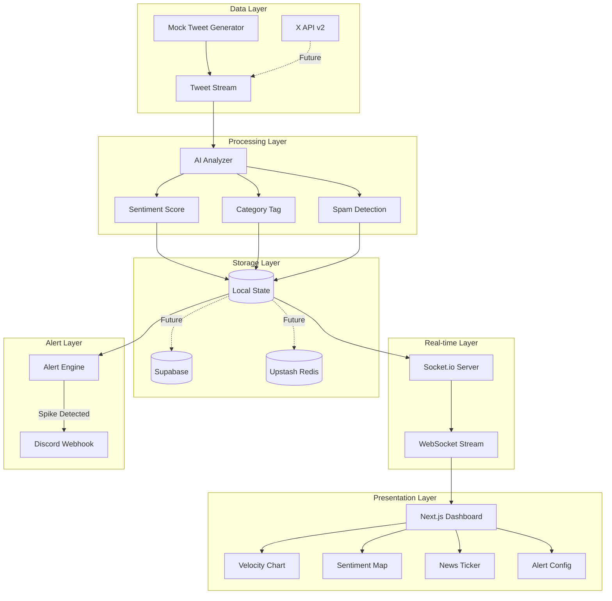

# X News Crawler Dashboard - Implementation Plan

A production-grade real-time news dashboard that crawls X/Twitter data, applies AI-powered analysis (sentiment, categorization, spam detection), and visualizes insights through an interactive "Command Center" UI.

## User Review Required

> [!IMPORTANT]
> **API Keys & Services**: This project requires the following external services. Please confirm you have or can obtain:
> - **Gemini API Key** - For AI-powered sentiment analysis and categorization
> - **X/Twitter API v2** (Optional) - For live data ingestion
> - **Supabase Project** (Optional) - For production database
> - **Upstash Redis** (Optional) - For caching layer
> - **Discord Webhook URL** (Optional) - For alert notifications

> [!WARNING]
> **Initial Implementation**: For development purposes, I'll create a **fully functional demo with mock data** that simulates real X/Twitter behavior. This allows you to showcase the dashboard without immediate API access. The architecture will be designed to easily swap in real APIs later.

---

## Proposed Changes

### Component 1: Project Foundation

#### [NEW] [x-news-crawler](file:///C:/Users/ADMIN/.gemini/antigravity/scratch/x-news-crawler)
Complete Next.js 15+ project with App Router, configured with:
- TypeScript for type safety
- Shadcn/UI component library with dark "Command Center" theme
- Tailwind CSS (required by Shadcn/UI)
- Custom CSS variables for the dark cyberpunk aesthetic

---

### Component 2: Database & State Management

#### [NEW] [lib/db/schema.ts](file:///C:/Users/ADMIN/.gemini/antigravity/scratch/x-news-crawler/lib/db/schema.ts)
Database schema definitions for:
- `tweets` - Raw tweet data with metadata
- `sentiment_cache` - Cached AI analysis results
- `alerts` - User-configured alert rules
- `velocity_snapshots` - Time-series volume data

#### [NEW] [lib/store/](file:///C:/Users/ADMIN/.gemini/antigravity/scratch/x-news-crawler/lib/store/)
Zustand-based state management for real-time UI updates

---

### Component 3: Mock Data Engine

#### [NEW] [lib/mock/tweet-generator.ts](file:///C:/Users/ADMIN/.gemini/antigravity/scratch/x-news-crawler/lib/mock/tweet-generator.ts)
Realistic tweet generator that simulates:
- Various account types (verified, influencers, bots)
- Realistic engagement patterns
- Topic clustering and velocity spikes
- Timestamp distribution matching real X patterns

---

### Component 4: AI Processing Layer

#### [NEW] [lib/ai/analyzer.ts](file:///C:/Users/ADMIN/.gemini/antigravity/scratch/x-news-crawler/lib/ai/analyzer.ts)
Gemini 1.5 Flash integration for:
- **Sentiment Analysis**: Positive/Negative/Neutral scoring
- **Categorization**: Breaking News / Rumor / Opinion classification
- **Spam Detection**: Bot pattern recognition
- **Headline Generation**: Condensing similar tweets into headlines

---

### Component 5: Real-time Infrastructure

#### [NEW] [lib/realtime/socket-server.ts](file:///C:/Users/ADMIN/.gemini/antigravity/scratch/x-news-crawler/lib/realtime/socket-server.ts)
Socket.io server for pushing live updates to connected clients

#### [NEW] [lib/realtime/hooks.ts](file:///C:/Users/ADMIN/.gemini/antigravity/scratch/x-news-crawler/lib/realtime/hooks.ts)
React hooks for consuming real-time data streams

---

### Component 6: Dashboard UI Components

#### [NEW] [components/dashboard/](file:///C:/Users/ADMIN/.gemini/antigravity/scratch/x-news-crawler/components/dashboard/)
```
├── VelocityChart.tsx      # Real-time line graph with spike alerts
├── SentimentMap.tsx       # Scatter plot clustering by meaning
├── SignalFilter.tsx       # Spam/bot/influence toggle controls
├── NewsTicker.tsx         # AI-generated scrolling headlines
├── TweetCard.tsx          # Individual tweet display
├── StatsPanel.tsx         # Key metrics display
└── AlertConfig.tsx        # Agentic alert setup modal
```

#### [NEW] [app/page.tsx](file:///C:/Users/ADMIN/.gemini/antigravity/scratch/x-news-crawler/app/page.tsx)
Main dashboard layout with:
- Command Center dark theme
- Responsive grid layout
- Real-time data binding

---

### Component 7: Alert System

#### [NEW] [lib/alerts/engine.ts](file:///C:/Users/ADMIN/.gemini/antigravity/scratch/x-news-crawler/lib/alerts/engine.ts)
Alert processing engine:
- Spike detection algorithm (300% threshold monitoring)
- Sentiment correlation
- Discord webhook dispatch

---

## Architecture Diagram



---

## Verification Plan

### Automated Tests

1. **Build Verification**
   ```bash
   cd C:\Users\ADMIN\.gemini\antigravity\scratch\x-news-crawler
   npm run build
   ```
   Expected: Successful build with no TypeScript errors

2. **Lint Check**
   ```bash
   npm run lint
   ```
   Expected: No linting errors

### Browser Testing

3. **Dashboard Visual Verification**
   - Start dev server: `npm run dev`
   - Open `http://localhost:3000` in browser
   - Verify:
     - ✅ Dark "Command Center" theme is applied
     - ✅ Velocity chart shows animated real-time data
     - ✅ Sentiment scatter plot renders with clustered points
     - ✅ News ticker scrolls with AI-generated headlines
     - ✅ Signal/Noise toggle filters work correctly
     - ✅ Responsive layout on different screen sizes

4. **Real-time Simulation Test**
   - Watch the dashboard for 30 seconds
   - Verify tweets appear in real-time with smooth animations
   - Trigger a simulated spike and verify alert notification appears

### Manual User Verification

5. **Alert Configuration Test**
   - Open the Alert Configuration modal
   - Set up a test alert with Discord webhook
   - Verify the alert fires when conditions are met (if webhook provided)
